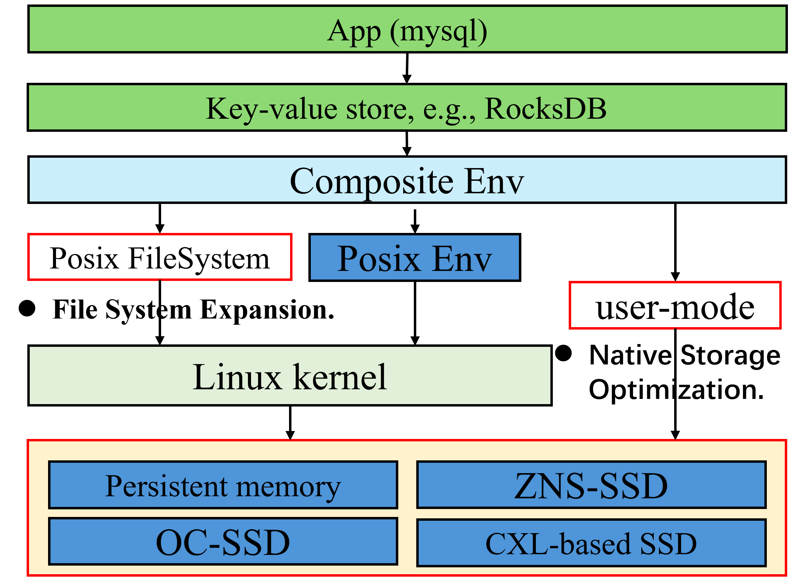
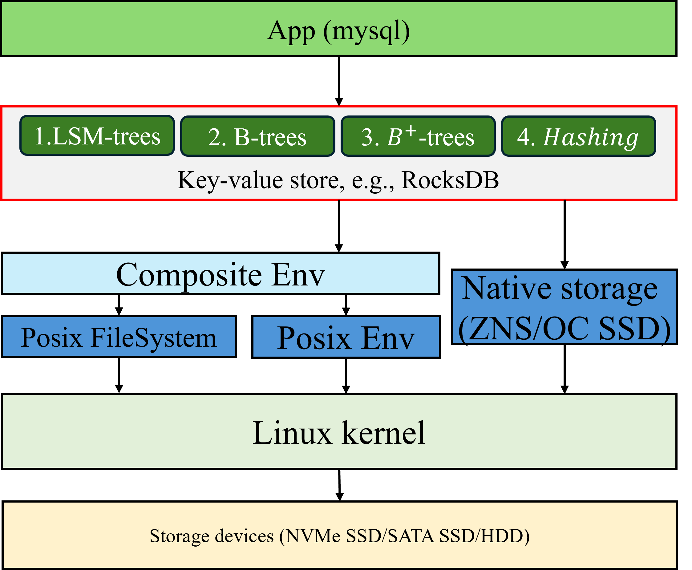

---
I'm currently a third-year graduate student at the [ShenZhen Institute of Advanced Technology (SIAT)](https://english.siat.ac.cn/), affiliated with the [University of Chinese Academy of Sciences (UCAS)](https://english.ucas.ac.cn/). I am advised by [Prof. Meng Jintao](http://210.75.252.46/jintao/)and [Prof. Wang Yang](https://people.ucas.edu.cn/~yangwang) in SIAT. My primary research collaborations are with [Prof. Dr.-Ing. André Brinkmann](https://research.zdv.uni-mainz.de/people/andre-brinkmann/) at Johannes Gutenberg - Universität Mainz. Together, we have been working on a combination of computer systems and databases, especially for key-value store optimization.

**I am currently looking forward to a PhD position.**

Research Interests
======

    
    

        <h3>Data-driven Database Tuning</h3>
        
Utilizing stochastic planning, machine learning (ML), or LLM to auto-tune data structures (e.g., B+-trees, LSM-trees) to ensure optimal performance across diverse read/write workloads.

    

    

        <h3>NoSQL Data Management Systems</h3>
        
Optimizing the NoSQL databases, including Key-Value (KV) stores, Graph databases (DBs), and Document DBs, while developing new structures (e.g., new LSM-like structures) to improve read/write performance and scalability. <a href="#vldb2025">LuMDB</a>.

    

    

    
    

        <h3>Modern Hardware Acceleration</h3>
        
 Leveraging (not based) cutting-edge hardwares, e.g., NVMe SSDs, persistent memory (PM), and Zone-namespace (ZNS) SSDs, to enhance performance in:

        <ul>
            <li><b>File System Expansion</b>: Expanding the capabilities of file systems (e.g., EXT4) to support better high-performance apps (e.g., KV stores, RDBs).</li>
            <li><b>Native Storage Optimization</b>: Application-specific (e.g., KV store) optimizations on native storage. <a href="#wise2024">REXIO</a>.</li>
        </ul>
    

Selected Publications
======

**2024**

1.   "REXIO: Indexing for Low Write Amplification by Reducing Extra I/Os in Key-Value Store under Mixed Read/Write Workloads", **Zizhao Wang**,Jintao Meng*,Nan Han,Zhelang Deng,Yizhuo Ma,Xiaowen Huang, International Web Information Systems Engineering conference, main Track (WISE main), 2024. [PDF](../conference_pdfs/REXIO.pdf) [Code](https://github.com/Zizhao-Wang/REXIO)
1.   "Low Unleashes More: Separating low-Access Data for Optimal Read/Write in LSM-based Key-Value Stores", **Zizhao Wang**,Yunjue Gu,Wenhan Feng,Jintao Meng,Yang Wang,André Brinkmann, 2024. [PDF](#) [Code](https://github.com/Zizhao-Wang/LuMDB)